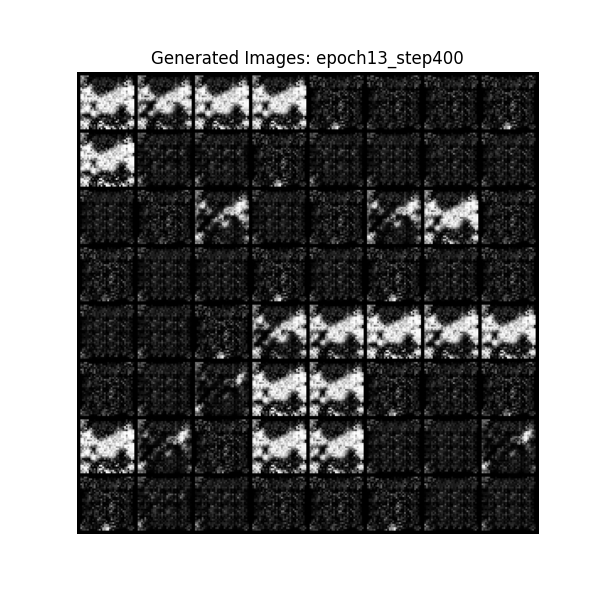

# 💡 GenAI FastTrack Portfolio Project

Welcome to **GenAI FastTrack**, a portfolio-ready showcase of Generative AI applications across both vision (DCGAN) and reasoning systems (LLM-enhanced fraud detection). This project demonstrates your ability to work with rule-based engines, model inference, streamlit UIs, and real-world data scenarios.

---

## 📁 Project Structure

```bash
genai_fasttrack/
├── genai_rl_agents/
│   ├── dcgan_mnist.py
│   ├── fraud_risk_agent.py
│   ├── fraud_risk_streamlit.py
│   ├── fraud_rules.json
├── transformers_llm/
│   ├── huggingface_inference.py
│   ├── miniGPT_sample.py
├── assets/
│   ├── generated_mnist_sample.png
│   ├── streamlit_home.png
│   ├── streamlit_result.png
├── data/
├── output/
├── requirements.txt
└── README.md
```
---

---

## 🧠 1. DCGAN for MNIST (`dcgan_mnist.py`)

Train a Deep Convolutional GAN to generate handwritten digits from the MNIST dataset.

- Generator and Discriminator implemented from scratch
- Custom training loop with `torchvision.utils.make_grid`
- Model output saved under `output/` after each epoch

### 📸 Sample Output (Epoch 10)


> *Digits generated after 13 epochs of DCGAN training using PyTorch*

---

## 🛡️ 2. Fraud Risk Agent (`fraud_risk_agent.py`)

A hybrid risk engine that classifies transactions using:

- ✅ Rule-based scoring from `fraud_rules.json`
- 🤖 Optional LLM-based enhancement
- 🔍 Returns score, risk level, reasons, and recommendations

Designed for use in batch scoring, dashboards, or REST API backends.

---

## 🌐 3. Streamlit UI (`fraud_risk_streamlit.py`)

Interactive web interface for entering or uploading transaction data and reviewing fraud assessments in real time. Built with **Streamlit**, this front-end empowers real-time exploration of transaction risk factors.

### 🖼️ Home Interface

This is the default landing page for users to begin manual input or upload a transaction file.


---

### 🔍 Risk Breakdown for Sample Case

> 💳 “$3200 online purchase made in Japan at 2 AM using a new iPhone by a user from Singapore with only 12 days of account age.”

Once evaluated, the app displays a summary of:
- Fraud Score (`0–100`)
- Risk Level (Low, Medium, High)
- Action Recommendation (Approve, Investigate, Block)
- Interpretable Reasons


---

### 📊 Visualisation on Fraud Score History

The app plots a real-time graph of fraud scores from past evaluations for comparison and trend monitoring. Each transaction is labeled and the score is plotted in temporal order.


---

### 🧾 Keeping Records on Transaction History

After each transaction is submitted, it is added to an interactive table showing:
- Summary description
- Assigned fraud score
- Risk level

This feature is useful for auditors, model debugging, or dashboard integration.


---

### 📖 Detailed Breakdown on the Fraud Score

Each individual prediction is backed by reason codes extracted from rule-based logic and LLM-enhanced logic (if enabled). These reasons ensure interpretability of the model’s decision.

Example reasons may include:
- High amount
- New device
- Foreign location mismatch
- Unusual transaction hour
- High-risk country


---

## 🤖 4. LLM Inference Utilities (`huggingface_inference.py`)

Reusable wrapper around HuggingFace Transformers for:

- Tokenization, logits, and pipeline usage
- Can be extended to support RAG-style reasoning and GPT-based response generation

---

## ✅ Running the Project

```bash
# Clone and install
git clone https://github.com/stevokwon/genai_fasttrack.git
cd genai_fasttrack
pip install -r requirements.txt
